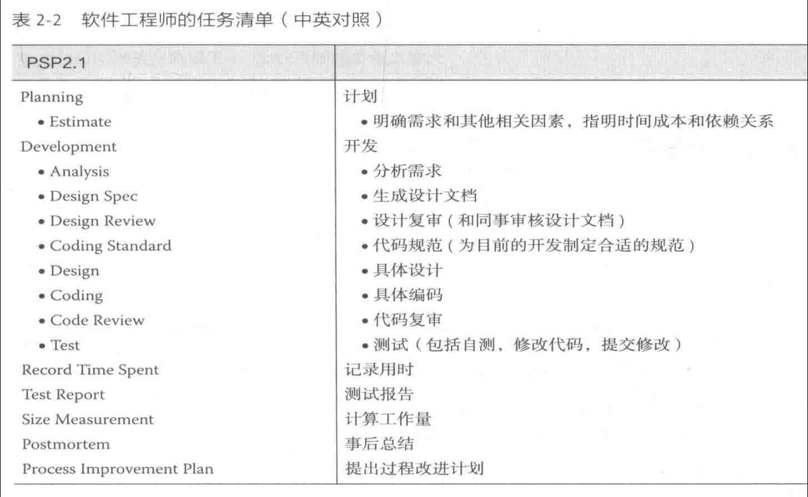

# "你帮我助"软件开发  

[](https://www.python.org)  

本项目是上海交通大学《软件工程》第一次项目作业。  

## 任务需求  
  

## 使用帮助  
*由于GUI尚未开发完成，本软件只能通过命令行交互，从'./foo/main.py'进入命令行交互，数据存储在 `DATA.csv`*  

进入程序，出现提示符如下：  
```python
输入数字选择对应操作：  
1. 添加物品信息  
2. 删除物品信息  
3. 显示物品列表  
4. 查找物品信息  
5. 退出程序  
``` 

输入对应数字按输出提示操作。